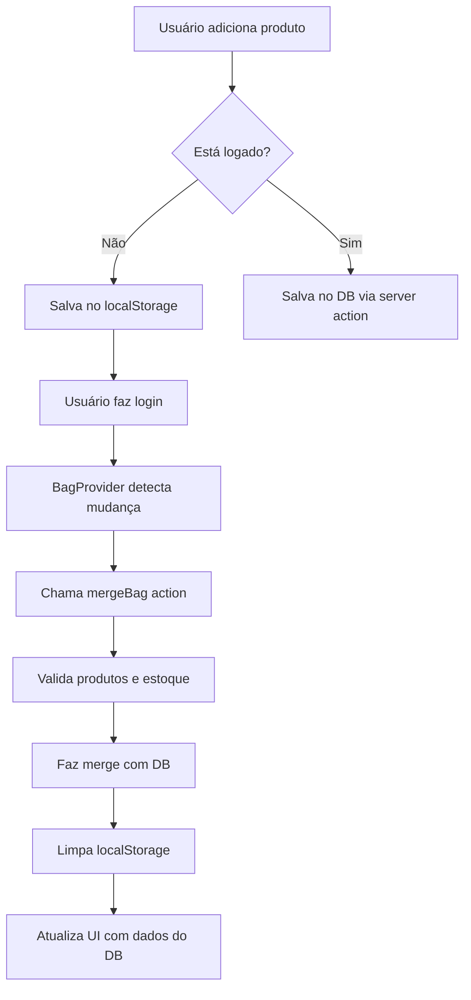

# Carrinho para Usuários Não Logados

## 📋 Resumo da Implementação

Esta funcionalidade permite que usuários não autenticados adicionem produtos ao carrinho (armazenados no `localStorage`) e, ao fazer login, os itens são automaticamente sincronizados com o banco de dados.

## 🎯 Benefícios

- ✅ **Melhor UX**: Usuários podem navegar e adicionar produtos sem criar conta
- ✅ **Maior conversão**: Reduz fricção no processo de compra
- ✅ **Sincronização automática**: Merge inteligente ao fazer login
- ✅ **Validação de estoque**: Verifica disponibilidade antes de persistir no DB

## 🏗️ Arquitetura

### 1. **Tipos TypeScript** (`src/types/bag.ts`)
Define interfaces e tipos para:
- `LocalBagItem`: Item no localStorage (apenas ID + quantidade)
- `LocalBag`: Estrutura do carrinho local
- `BagItemWithRelations`: Tipo derivado do schema usando `$inferSelect` do Drizzle
- `BagWithTotal`: Carrinho com items e total calculado
- `BagContextValue`: API do contexto React

**Reutilização de tipos do schema:**
Os tipos do carrinho do DB são derivados automaticamente do schema do Drizzle, garantindo consistência e type-safety.

### 2. **BagProvider** (`src/providers/bag-provider.tsx`)
Context Provider que:
- Gerencia estado unificado do carrinho (local + DB)
- Detecta automaticamente se usuário está autenticado
- Sincroniza localStorage ↔ DB
- Expõe funções: `addItem`, `removeItem`, `updateQuantity`, `clearBag`

**Funcionamento:**
```
Usuário NÃO logado → localStorage
Usuário logado → Database (via server actions)
Login detectado → Merge automático
```

### 3. **Server Action de Merge** (`src/actions/merge-bag/index.ts`)
Responsável por:
- Receber itens do localStorage
- Validar cada produto (existe? tem estoque?)
- Fazer merge com carrinho existente no DB
- Somar quantidades ou criar novos items
- Respeitar limite de estoque

**Lógica de merge:**
- Se item já existe no DB → Soma quantidades
- Se item não existe → Cria novo registro
- Se produto sem estoque → Ignora (com warning)
- Se produto não encontrado → Ignora (com warning)

### 4. **Componentes Atualizados**

#### **Bag** (`src/components/commom/bag.tsx`)
- Usa `useBag()` hook para acessar o estado do carrinho
- Busca detalhes dos produtos para carrinho local via `getMultipleProductVariantSizeDetails`
- Mostra badge com total de itens (local ou DB)
- Renderiza items usando o mesmo componente `BagItem` para logado e não-logado
- Calcula subtotal automaticamente (local e DB)
- Lógica de loading unificada com skeleton states
- Mensagem "Sacola vazia" quando não há items

#### **BagItem** (`src/components/commom/bag-item.tsx`)
- Detecta automaticamente se é item local (ID começa com `local-`) ou do DB
- Usa `removeItem()` do hook para items locais
- Usa `removeBagProduct()` para items do DB
- Funciona perfeitamente para ambos os casos

#### **AddToBagButton** (`src/app/(main)/p/[slug]/components/add-to-bag-button.tsx`)
- Usa `addItem()` do contexto
- Funciona tanto logado quanto não logado
- Toast de feedback automático
- Loading state durante adição

### 5. **Server Actions Auxiliares**

#### **getProductVariantSizeDetails** (`src/actions/get-product-variant-size-details/index.ts`)
- Busca detalhes completos de produtos para o carrinho local
- Suporta busca de múltiplos produtos de uma vez
- Usado para exibir informações completas no carrinho de usuários não-logados

### 5. **Integração no Layout** (`src/app/layout.tsx`)
```tsx
<BagProvider isAuthenticated={!!session?.user}>
  {children}
</BagProvider>
```
- Provider envolvendo toda aplicação dentro do ReactQueryProvider
- Passa estado de autenticação detectado no servidor
- Integrado com ReactQuery para cache e invalidação de queries

## 🔄 Fluxo de Sincronização



## 📦 Estrutura de Dados

### localStorage
```json
{
  "items": [
    {
      "productVariantSizeId": 123,
      "quantity": 2
    },
    {
      "productVariantSizeId": 456,
      "quantity": 1
    }
  ]
}
```

### Database (após merge)
```sql
tb_bags: { id, userId }
tb_bag_items: { id, bagId, productVariantSizeId, quantity }
```

## 🚀 Como Usar

### Adicionar ao carrinho
```tsx
const { addItem } = useBag();

await addItem(productVariantSizeId);
```

### Acessar dados do carrinho
```tsx
const { bag, localBag, totalItems, totalPriceInCents, isAuthenticated } = useBag();
```

### Remover item
```tsx
const { removeItem } = useBag();

await removeItem(productVariantSizeId);
```

## ⚠️ Limitações Atuais

1. **Update de quantidade no DB**: Ainda não implementada (placeholder)
2. **Clear bag do DB**: Ainda não implementada (placeholder)

## ✅ Funcionalidades Implementadas

- ✅ **Adicionar items** - Funciona para logado e não-logado
- ✅ **Remover items** - Funciona para logado e não-logado  
- ✅ **Visualizar items** - Mesma UI para ambos os casos
- ✅ **Calcular preços** - Subtotal correto em ambos os modos
- ✅ **Merge automático** - Sincroniza ao fazer login
- ✅ **Validação de estoque** - Verifica antes de adicionar ao DB

## 🔮 Melhorias Futuras

- [ ] Implementar update de quantidade no DB e localStorage
- [ ] Implementar clear bag completo (DB + localStorage)
- [ ] Adicionar TTL para items no localStorage (ex: 30 dias de expiração)
- [ ] Analytics: track carrinho abandonado
- [ ] Notificação ao usuário sobre items que ficaram fora de estoque durante merge
- [ ] Migração de carrinho entre dispositivos (via session storage)
- [ ] Suporte a cupons de desconto no carrinho local
- [ ] Salvar carrinho no servidor antes de expirar localStorage

## 🧪 Testando

1. **Usuário não logado:**
   - Adicione produtos ao carrinho
   - Verifique localStorage: `localStorage.getItem('guest-bag')`
   - Badge deve mostrar quantidade correta
   - Abra o carrinho e veja os items com detalhes completos
   - Remova um item e verifique que foi removido do localStorage

2. **Fazer login com carrinho local:**
   - Adicione produtos sem estar logado
   - Faça login
   - Carrinho local deve ser mergeado automaticamente com o DB
   - localStorage deve ser limpo após merge
   - Items devem aparecer na sacola do usuário logado

3. **Usuário logado:**
   - Adições vão direto para o DB
   - Remoções atualizam o DB imediatamente
   - Sem uso de localStorage
   - Sacola persiste entre sessões

4. **Validações:**
   - Produtos sem estoque são ignorados no merge
   - Produtos deletados são ignorados no merge
   - Quantidades são somadas corretamente no merge

## 📝 Observações Técnicas

- **SSR Safe**: Todos os acessos ao localStorage verificam `typeof window`
- **Error Handling**: Try/catch em todas operações de localStorage
- **Type Safety**: Tipos derivados do schema Drizzle usando `$inferSelect`
- **Performático**: Operações locais são síncronas, DB é assíncrono
- **Resiliente**: Se localStorage falhar, aplicação continua funcionando
- **Queries otimizadas**: Busca múltiplos produtos de uma vez para melhor performance
- **Invalidação automática**: Queries são invalidadas ao adicionar/remover items
- **Loading states**: Skeleton unificado para melhor UX

---

**Criado em:** 2025-11-11  
**Última atualização:** 2025-11-12  
**Versão:** 1.1.0
